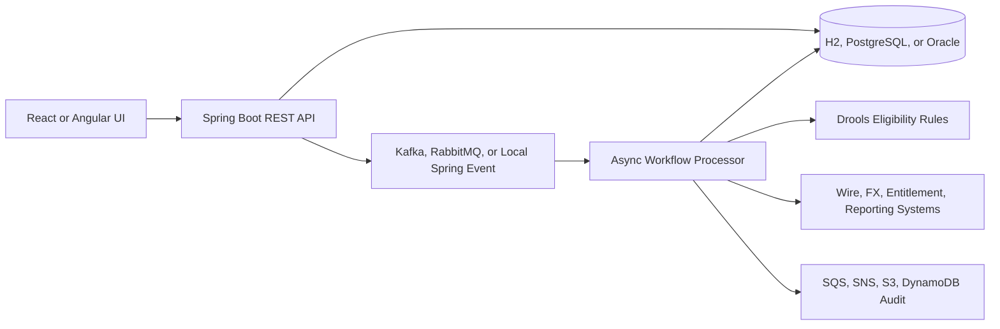

# Treasury Workflow Microservices

This repository contains a runnable treasury operations workflow application inspired by commercial banking request processing. It models the pattern described in the project brief: a request is accepted quickly, stored with a request ID, published as an event, processed asynchronously, and tracked through eligibility, approval, downstream dispatch, and completion.

The default profile runs with H2 and local Spring events so the app starts without external infrastructure. Docker profiles add PostgreSQL, Kafka, RabbitMQ, and LocalStack for a fuller microservices-style environment.

## What Is Implemented

- Java 8 compatible Spring Boot 2.7 backend
- REST APIs for treasury request creation, status search, approval, failure, timeline, and dashboard metrics
- Spring Security with demo banker, operations, and admin users
- JPA/Hibernate persistence with H2 by default and PostgreSQL/Oracle profiles
- Drools eligibility rules for treasury request decisions
- Spring Batch job for stuck-request aging
- Asynchronous workflow processing with request ID traceability
- Kafka and RabbitMQ publisher/consumer profiles
- AWS integration profile for SQS, SNS, S3, and DynamoDB audit publishing
- React, TypeScript, and Bootstrap request portal
- Angular, TypeScript, and Bootstrap operations console example
- Docker Compose for Postgres, Kafka, RabbitMQ, LocalStack, backend, and frontend
- Kubernetes manifests, Terraform EKS skeleton, CloudFormation stack, Jenkinsfile, and GitHub Actions

## Quick Start: Backend

```bash
mvn -pl services/treasury-workflow-service spring-boot:run
```

The service starts on [http://localhost:8080](http://localhost:8080).

Demo users:

| User | Password | Role |
| --- | --- | --- |
| banker | banker123 | Create and approve requests |
| operations | ops123 | Operations review |
| admin | admin123 | Admin access |

Create a request:

```bash
curl -u banker:banker123 \
  -H "Content-Type: application/json" \
  -d '{
    "clientName": "Acme Manufacturing",
    "accountNumber": "782233100",
    "requestType": "WIRE_SETUP",
    "paymentAmount": 45000,
    "paymentCurrency": "USD",
    "createdBy": "banker",
    "riskScore": 42,
    "destinationSystem": "WIRE_PLATFORM"
  }' \
  http://localhost:8080/api/treasury/requests
```

Search requests:

```bash
curl -u operations:ops123 http://localhost:8080/api/treasury/requests
```

OpenAPI UI is available at [http://localhost:8080/swagger-ui.html](http://localhost:8080/swagger-ui.html).

## Quick Start: React Portal

```bash
cd frontend/react-portal
npm install
npm run dev
```

The React portal runs on [http://localhost:5173](http://localhost:5173) and calls the backend at `http://localhost:8080`.

## Docker Compose

Run the fuller stack:

```bash
docker compose up --build
```

Services:

- Backend: [http://localhost:8080](http://localhost:8080)
- React portal: [http://localhost:5173](http://localhost:5173)
- RabbitMQ console: [http://localhost:15672](http://localhost:15672)
- Kafka: `localhost:9092`
- PostgreSQL: `localhost:5432`
- LocalStack: `localhost:4566`

The default Compose backend profile uses PostgreSQL and Kafka. RabbitMQ can be tested by running the backend with `SPRING_PROFILES_ACTIVE=postgres,rabbit`.

## Repository Layout

```text
services/treasury-workflow-service   Spring Boot REST, workflow, rules, messaging, batch
frontend/react-portal                React/TypeScript/Bootstrap request UI
frontend/angular-ops-console         Angular/TypeScript/Bootstrap operations console
infra/kubernetes                     Kubernetes manifests for EKS-style deployment
infra/terraform                      Terraform EKS and AWS service skeleton
infra/cloudformation                 CloudFormation stack for AWS service dependencies
```

## Architecture



## Notes

This is a training and portfolio implementation. It does not connect to Wells Fargo systems and should not be treated as bank production software. Secrets, real IAM policies, fraud controls, approvals, and compliance controls would need to be implemented according to the target institution's standards.
