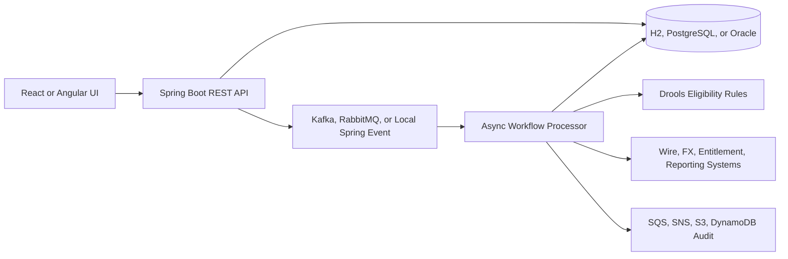

# Treasury Workflow Microservices

This repository contains a runnable treasury operations workflow application inspired by commercial banking request processing. It models the pattern described in the project brief: a request is accepted quickly, stored with a request ID, published as an event, processed asynchronously, and tracked through eligibility, approval, downstream dispatch, and completion.

The default profile runs with H2 and local Spring events so the app starts without external infrastructure. Docker profiles add PostgreSQL, Kafka, RabbitMQ, and LocalStack for a fuller microservices-style environment.

## What Is Implemented

- Java 8 compatible Spring Boot 2.7 backend
- REST APIs for treasury request creation, status search, approval, failure, timeline, and dashboard metrics
- Spring Security with demo banker, operations, and admin users
- JPA/Hibernate persistence with H2 by default and PostgreSQL/Oracle profiles
- Drools eligibility rules for treasury request decisions
- Spring Batch job for stuck-request aging
- Asynchronous workflow processing with request ID traceability
- Kafka and RabbitMQ publisher/consumer profiles
- AWS integration profile for SQS, SNS, S3, and DynamoDB audit publishing
- React, TypeScript, and Bootstrap request portal
- Angular, TypeScript, and Bootstrap operations console example
- Docker Compose for Postgres, Kafka, RabbitMQ, LocalStack, backend, and frontend
- Kubernetes manifests, Terraform EKS skeleton, CloudFormation stack, Jenkinsfile, and GitHub Actions

## Quick Start: Backend

```bash
mvn -pl services/treasury-workflow-service spring-boot:run
```

The service starts on [http://localhost:8080](http://localhost:8080).

Demo users and portals:

| User | Password | Role |
| --- | --- | --- |
| banker | banker123 | Banker Request Portal: create requests and track status |
| manager | manager123 | Manager Approval Portal: approve high-value and FX requests |
| operations | ops123 | Operations Monitor: view requests and mark operational failures |
| admin | admin123 | Admin Control Portal: full workflow access |

Approval ownership:

- Bankers create requests for client treasury work such as wire setup, FX payment, eligibility checks, account access changes, and reporting changes.
- Managers approve requests that rules route to `PENDING_APPROVAL`, such as FX payments or payments greater than or equal to `100000`.
- Operations users monitor the queue, trace failures, and can mark a request as failed.
- Admin users can perform all demo actions.

Create a request:

```bash
curl -u banker:banker123 \
  -H "Content-Type: application/json" \
  -d '{
    "clientName": "Acme Manufacturing",
    "accountNumber": "782233100",
    "requestType": "WIRE_SETUP",
    "paymentAmount": 45000,
    "paymentCurrency": "USD",
    "createdBy": "banker",
    "riskScore": 42,
    "destinationSystem": "WIRE_PLATFORM"
  }' \
  http://localhost:8080/api/treasury/requests
```

Search requests:

```bash
curl -u operations:ops123 http://localhost:8080/api/treasury/requests
```

Approve a pending request:

```bash
curl -u manager:manager123 \
  -H "Content-Type: application/json" \
  -d '{"actor":"manager","reason":"Manager approved treasury request"}' \
  http://localhost:8080/api/treasury/requests/TR-REQUEST-ID/approve
```

OpenAPI UI is available at [http://localhost:8080/swagger-ui.html](http://localhost:8080/swagger-ui.html).

## Quick Start: React Portal

```bash
cd frontend/react-portal
npm install
npm run dev
```

The React portal runs on [http://localhost:5173](http://localhost:5173) and calls the backend at `http://localhost:8080`.

## Live Demo Workflow

Use this sequence when explaining the project on a vendor call.

1. Sign in as `banker` / `banker123`.
2. Create a normal `WIRE_SETUP` request with amount `45000`, currency `USD`, and risk score `42`.
3. Show that the API returns quickly with a `TR-...` request ID while background processing moves the request through `API_INTAKE`, `DROOLS_ELIGIBILITY`, `ELIGIBILITY_COMPLETE`, `DOWNSTREAM_DISPATCH`, and `DOWNSTREAM_ACK`.
4. Create an `FX_PAYMENT` request or any request with amount `100000` or higher.
5. Show that it stops at `PENDING_APPROVAL`.
6. Sign out, sign in as `manager` / `manager123`, select the pending request, and approve it.
7. Show that the timeline records the manager approval and then continues to downstream completion.
8. Sign in as `operations` / `ops123` to show the monitoring view and failure action.

Talking point: the application demonstrates the resume project pattern where tightly coupled request processing was moved into a traceable asynchronous workflow. The user receives a request ID immediately, while rules, approvals, messaging, and downstream dispatch run in the background.

## Database Access

The default local run uses H2 in-memory database so the app starts quickly without installing Oracle or PostgreSQL.

Open the H2 console:

[http://localhost:8080/h2-console](http://localhost:8080/h2-console)

Use these connection values:

| Field | Value |
| --- | --- |
| Driver Class | `org.h2.Driver` |
| JDBC URL | `jdbc:h2:mem:treasury;MODE=PostgreSQL;DB_CLOSE_DELAY=-1;DB_CLOSE_ON_EXIT=FALSE` |
| User Name | `sa` |
| Password | leave blank |

Main tables:

- `TREASURY_REQUESTS`: current request status, client, request type, assigned system, approval user, and status reason.
- `REQUEST_STATUS_EVENTS`: full trace timeline for each request ID.
- Spring Batch metadata tables: batch job state for the request-aging job.

Example H2 queries:

```sql
select request_id, client_name, request_type, status, current_stage, created_by, approved_by
from treasury_requests
order by updated_at desc;

select request_id, status, stage, actor, message, created_at
from request_status_events
order by created_at asc;
```

For PostgreSQL mode, run Docker Compose and connect with:

| Field | Value |
| --- | --- |
| Host | `localhost` |
| Port | `5432` |
| Database | `treasury` |
| User | `treasury` |
| Password | `treasury` |

PostgreSQL profile command:

```bash
mvn -pl services/treasury-workflow-service spring-boot:run -Dspring-boot.run.profiles=postgres
```

Oracle profile support is included in `application-oracle.yml`; use the target institution's Oracle URL, username, password, schema controls, and wallet/secrets process in a real environment.

## Docker Compose

Run the fuller stack:

```bash
docker compose up --build
```

Services:

- Backend: [http://localhost:8080](http://localhost:8080)
- React portal: [http://localhost:5173](http://localhost:5173)
- RabbitMQ console: [http://localhost:15672](http://localhost:15672)
- Kafka: `localhost:9092`
- PostgreSQL: `localhost:5432`
- LocalStack: `localhost:4566`

The default Compose backend profile uses PostgreSQL and Kafka. RabbitMQ can be tested by running the backend with `SPRING_PROFILES_ACTIVE=postgres,rabbit`.

## Repository Layout

```text
services/treasury-workflow-service   Spring Boot REST, workflow, rules, messaging, batch
frontend/react-portal                React/TypeScript/Bootstrap request UI
frontend/angular-ops-console         Angular/TypeScript/Bootstrap operations console
infra/kubernetes                     Kubernetes manifests for EKS-style deployment
infra/terraform                      Terraform EKS and AWS service skeleton
infra/cloudformation                 CloudFormation stack for AWS service dependencies
```

## Architecture



## Scaling To A Larger Online Treasury Platform On AWS

For a larger production-style platform, split this demo into separately deployed services and managed cloud components:

- Frontend: host the React portal on S3 plus CloudFront, or serve it through an internal ALB if it must stay private.
- API layer: run Spring Boot services on EKS behind an Application Load Balancer or API Gateway.
- Identity and access: replace demo Basic Auth with enterprise SSO, OAuth2/OIDC, IAM roles for workloads, Secrets Manager, and least-privilege policies.
- Database: use Amazon RDS or Aurora PostgreSQL for operational request state, with read replicas for reporting and point-in-time recovery.
- Messaging: use Amazon MSK for Kafka event streaming, Amazon MQ for RabbitMQ-style broker compatibility, or SQS/SNS for simpler async queues and notifications.
- Rules and workflow: keep eligibility and approval orchestration in a workflow service; externalize rules and approvals so policy changes do not require redeploying every service.
- Audit and reporting: write immutable request events to S3, operational lookup state to DynamoDB, and dashboards to OpenSearch or a reporting warehouse.
- Observability: use CloudWatch logs and metrics, X-Ray or OpenTelemetry tracing, structured request IDs, alarms, and dashboards by status, downstream system, and SLA age.
- Resilience: add retries, dead-letter queues, idempotency keys, circuit breakers, timeout budgets, and replay tooling for failed downstream events.
- Delivery: build with GitHub Actions or Jenkins, publish Docker images to ECR, deploy with Terraform or CloudFormation, and use blue-green or canary deployments on EKS.
- Security: use WAF, private subnets, security groups, KMS encryption, database encryption, audit logging, and environment-specific secrets.

Resume alignment:

- Java 8, Spring Boot, REST APIs, Spring Security, Hibernate/JPA, SQL, Spring Batch, and Drools are represented in the backend service.
- Kafka, RabbitMQ, event-driven processing, request status tracking, and downstream routing are represented by the messaging and async workflow layer.
- React, TypeScript, Bootstrap, and role-based portals are represented in the frontend.
- Docker, Kubernetes, EKS, Terraform, CloudFormation, Jenkins, GitHub Actions, and AWS services are represented in the deployment and infrastructure folders.
- The business story matches commercial banking treasury operations: faster API response, async processing, manager approval routing, eligibility checks, request ID traceability, and operational debugging.

## Notes

This is a training and portfolio implementation. It does not connect to Wells Fargo systems and should not be treated as bank production software. Secrets, real IAM policies, fraud controls, approvals, and compliance controls would need to be implemented according to the target institution's standards.
